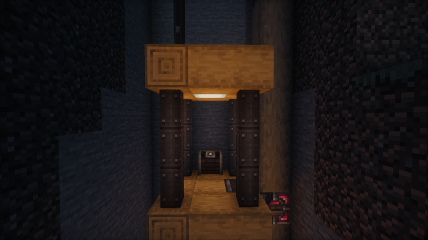
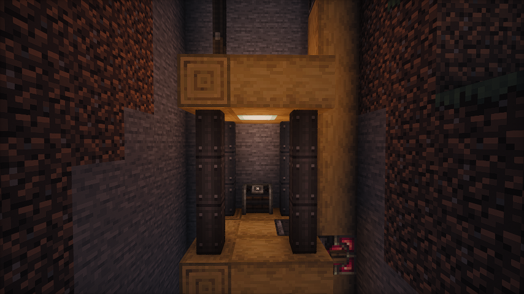
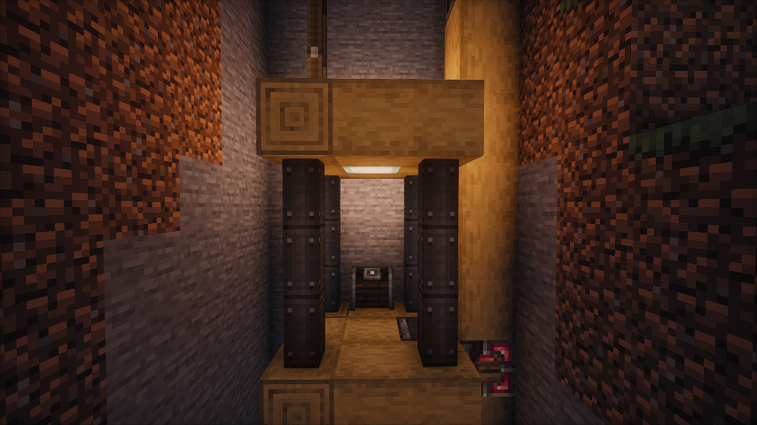

# Create-Dynamic-Lights
Add dynamic lights to the Create mod.

## Features
1. Dynamic Lighting for Contraptions:
    - Automatically create light blocks when Contraptions move.
2. Support LambDynamicLights:
    - Add and update light sources for LambDynamicLights mod as Contraptions move, allowing for smoother lighting effects.

## Dependencies

### Fabric
1. Create-Fabric (Required)
2. LambDynamicLights (Recommended)

### Forge
1. Create (Required)
2. Embeddium/Rubidium Dynamic Lights (Recommended)

## Server and Client Support
| Feature        | Server Only | Client Only |  Both Side  |
|----------------|:-----------:|:-----------:|:-----------:|
| Light Block    |     Yes     |     No      |     Yes     |
| Dynamic Lights |     No      |     Yes     |     Yes     |

- [x] Only installed on the server.
  - You can use the Light Block to create light sources even if the client doesn't have the mod installed. The client will see the light sources, and the performance impact may be heavy.
- [x] Only installed on the client.
  - The client can see the light sources created by the LimbDynamicLights mod but the light sources only has visual effects and no actual light source is created.

## Known Issues
1. On Fabric, if the mod is installed only on the client side, the client will crash when you modify and save the server configuration.
   - This issue is caused by the Porting Lib. For servers, I recommend installing the mod even if you don't want to use the Light Block effect. This can prevent client crashes and exception logs on the server side.

## Preview

No dynamic light

Default dynamic light

Brighter dynamic light (set the luminance multiplier to 1.2)

### Some gifs
- 
  - As the elevator moves, the light illuminates the surrounding area.

- 
  - Enable the light block. As the bearing moves, the light block is created and removed. You can see the light is a little flicker.

- 
  - Disable the light block and enable the LimbDynamicLight. There is no flicker, and the light is smoother.

## Q&A
1. Q: Why and when to use the light block?
   - A: The Light Block is a block that emits light. It's invisible and intangible, making it ideal for creating light sources in the game world. It can affect the environment by melting ice or snow and preventing mob spawning. However, the Light Block can impact performance, and the light source isn’t smooth when the contraption moves. Therefore, I recommend using the LambDynamicLights mod for smoother lighting effects. There might be two reasons for using the Light Block:
     1. The client doesn't have the LambDynamicLights mod installed or this mod installed.
     2. You want to create a light source that can affect the environment, such as melting ice or snow.
